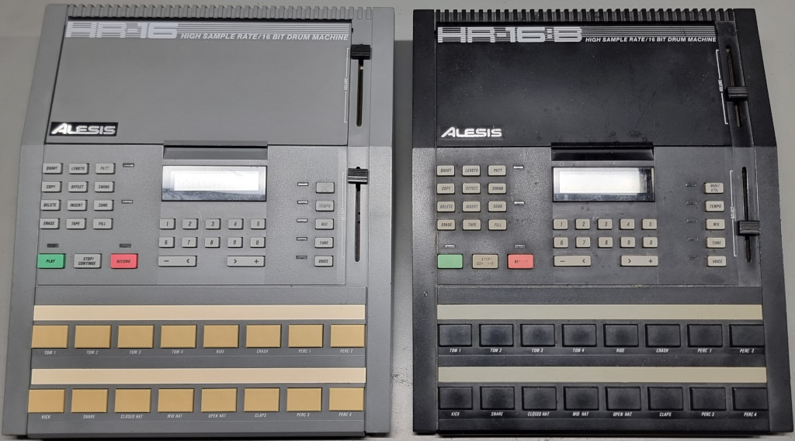

# Alesis HR-16(B) Repair Aid

This is a kind of repair aid for all lovers/upcyclists of old music electronics and machines.

This project has no commercial intentions and is merely a hobby project that was/is created during the repair work on an Alesis HR-16. No guarantee for completeness or correctness. Use at your own risk!

## Tools used/required

* KiCAD 8
* Digital multimeter
* Oscilloscope
* Brain, Hands, Beer, ...

## Schematic Naming Conventions

* Parts are typically numbered automatically in KiCAD. To get sure, the part names correspond to the real ones on the PCB, the suffix `_I` is added to all __correct identified__ componontes (e.g. `C6` becomes `C6_I`). This ensures that the name in the schematic will stay static and indicates that it is the real name of the component.

## Faults / Faulty Components

### `C8_I`

* C = 4.7 uF
* U = 50 V
* Pitch = 2,54 mm
* Height = 12 mm
* Fault: short circuit

### `C6_I`

* C = 470 uF
* U = 25 V
* Pitch 5,08 mm
* Height 16 mm
* Fault: short circuit

## License

Shield: [![CC BY-NC-SA 4.0][cc-by-nc-sa-shield]][cc-by-nc-sa]

This work is licensed under a
[Creative Commons Attribution-NonCommercial-ShareAlike 4.0 International License][cc-by-nc-sa].

[![CC BY-NC-SA 4.0][cc-by-nc-sa-image]][cc-by-nc-sa]

[cc-by-nc-sa]: http://creativecommons.org/licenses/by-nc-sa/4.0/
[cc-by-nc-sa-image]: https://licensebuttons.net/l/by-nc-sa/4.0/88x31.png
[cc-by-nc-sa-shield]: https://img.shields.io/badge/License-CC%20BY--NC--SA%204.0-lightgrey.svg

